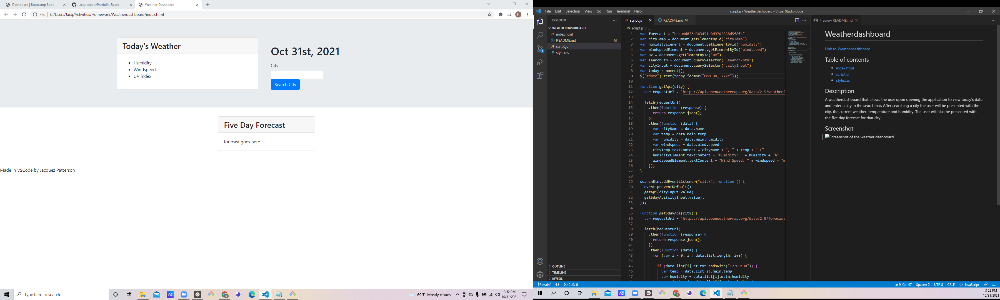

# Weatherdashboard

[Link to Weatherdashboard](<a href="file:///C:/Users/Jacq/Activities/Homework/Weatherdashboard/index.html">)

## Table of contents
- [index.html](Contains-the-html-document.)
- [script.js](Contains-the-javascript.)
- [style.css](Contains-the-css-styling.)

## Description
A weatherdashboard that allows the user upon opening the application to view today's date and enter a city in the search bar. After searching a city the user will be presented with the city, the current weather, temperature and humidity. The user will also be presented with the five day forecast for that city.

## Screenshot

## Usage
Access this weatherdashboard by opening in browser.

## License
None

## Badges
None